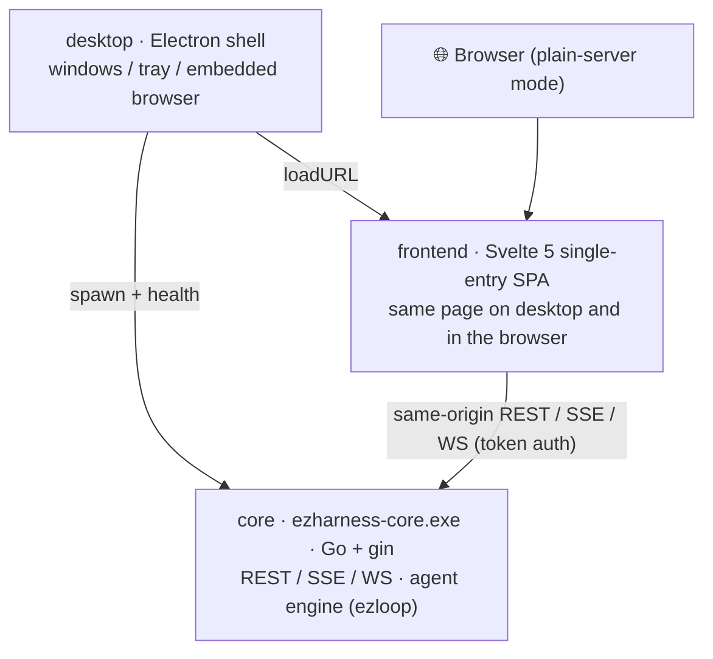

<!-- GIF checklist (auto-displays once added): docs/gif/overview.gif · first-chat.gif · fork.gif ·
     terminal.gif · browser.gif · board.gif · quickapp.gif · decision.gif -->

<div align="center">


# ezharness

**Simplicity, delivered to the user.**

One exe · Three roles · Zero config — a desktop agent harness built for the simplest possible user experience

[](https://github.com/xuanlv2002/ezharness/releases)
[](https://github.com/xuanlv2002/ezharness/releases)
[](LICENSE)
[](https://xuanlv2002.github.io/ezharness/)
[](https://go.dev)
[](https://svelte.dev)
[](https://www.electronjs.org/)

[简体中文](README.md) · **English**

</div>

---

ezharness is an AI assistant that runs on your computer: it can read and write files across the whole machine, drive a real terminal and browser, and keeps every step visible and under your control. It believes an assistant harness only needs to do three things well —

| Pillar | Focus |
|---|---|
| **Context engineering** | What enters the context, when it folds, and how the model always knows who it is, where it is, and what the user just did |
| **Tool wrapping** | System capabilities (files, terminal, browser, whiteboard, MCP…) wrapped as safe, controllable, ready-to-use tools |
| **Interaction design** | Human-agent surfaces beyond the chat: decision cards, global notifications, shared terminal and browser |


## Features

- **Tree-shaped sessions** — Parallel branches; fork from any message to explore alternatives; compact archives a session into long-term memory without losing data; switching branches never interrupts background runs
- **Shared terminal** — Human and agent share one real shell: take over anytime while the agent works; the agent knows what you typed last round
- **Shared browser** — A real embedded Chromium on desktop: the AI operates via tools, you take over natively on the same page
- **Decision cards & global notifications** — Four approval levels (always ask / blacklist / whitelist / fully auto) applied instantly; when any branch needs a human, the notification always finds you
- **Magic whiteboard** — Object-model canvas: annotate screenshots or draw, and hand it back to the conversation as an attachment
- **Quick apps** — Small tools generated by the agent (HTML etc.) launch as child windows in one click, with direct MCP access
- **MCP** — External tool servers (http / stdio): health checks, start/stop, hot reload
- **Triple memory** — Long-term memory (indexed into context, retrieved on demand) / capability memory (skills) / topic memory (session archives)
- **Four model slots** — main / vision / image / audio, each with usage stats
- **Security** — Token-authenticated API + same-origin pass; four approval levels; terminal commands blocked by substring match (better safe than sorry)

## Install

Grab a build from [Releases](https://github.com/xuanlv2002/ezharness/releases) (**wherever the exe runs, config and data live next to it**):

**Option 1: Portable (no install)**

1. Download `ezharness-v<version>.exe` (rename to `ezharness.exe` if you like), put it in any folder (e.g. `D:\ezharness`);
2. Add that folder to your PATH;
3. Run `ezharness` — first launch creates `ezharness.json` and `data\` next to it.

**Option 2: Installer**

1. Download and run the installer;
2. Pick an install directory; start-menu and desktop shortcuts are created, with an optional "add to PATH".

**Option 3: Plain server (no desktop shell)**

Run `ezharness-core.exe` directly and open `http://127.0.0.1:<port>` in a browser — same page as the desktop app (desktop-only capabilities such as browser control degrade gracefully).

## Up and running in 30 seconds

1. Open the "Models" page, enter your apiKey and pick a model;
2. Head back to the chat and hand over a task — file organization, scripting, error triage, web operations;
3. When the agent needs you (approval / question), a decision card shows up in the timeline and the notification corner.


## Core workflows

| Scenario | How |
|---|---|
| [Session forking](docs/md/session.md) | Click "fork" on any message to copy the prefix into a new branch; "compact" distills a long session into memory and starts a fresh generation |
| [Shared terminal](docs/interaction.md) | Open the terminal drawer: watch and take over the agent's shell; your keystrokes feed back into its context |
| Shared browser | Ask the agent to "open and operate this page" — the browser window pops up for co-viewing; take over anytime |
| Magic whiteboard | Drop a screenshot on the board, annotate what to change, send it back to the agent |
| Quick apps | Ask the agent to "build a small tool page", then launch it as a child window |
| MCP | Add MCP servers in settings; the agent discovers tools automatically; quick apps can call them too |


## Architecture at a glance

Three tiers; all business logic lives in one Go sidecar, the desktop shell stays a shell:



Division of labor with the sister repo [ezloop](https://github.com/xuanlv2002/ezloop): ezloop is a lean agent loop engine (model↔tool loop, hook / warp extension points, fork sub-agents); ezharness builds session management, context engineering, tool wrapping and interaction design on top.

## Documentation

The **[docs site](https://xuanlv2002.github.io/ezharness/)** supports Chinese/English switching and is organized from shallow to deep:

| Layer | Content | Entry |
|---|---|---|
| Getting started | Install, models, first chat | This page + [Get started](https://xuanlv2002.github.io/ezharness/#start) |
| User guide | Sessions / terminal / browser / whiteboard / quick apps / MCP | [User guide](https://xuanlv2002.github.io/ezharness/#guide) |
| Core concepts | Session tree, context engineering, human-agent interaction | [Core concepts](https://xuanlv2002.github.io/ezharness/#concepts) |
| Deep dives | Architecture, hook panorama, storage formats, context in action | [Architecture](https://xuanlv2002.github.io/ezharness/architecture.html) · [docs/md/](docs/md/) |
| Reference | Build, dev memo | [build.md](docs/build.md) · [AGENTS.md](AGENTS.md) |

## Building from source

Prerequisites: [Go](https://go.dev/dl/), [Node.js](https://nodejs.org/). To hack on [ezloop](https://github.com/xuanlv2002/ezloop) itself (release builds pull it from the module proxy — clone only if needed), point the `replace` in `core/go.mod` at your local ezloop checkout. Electron downloads are mirrored via npmmirror (`desktop/.npmrc`).

The version has a single source of truth in `script/version.yaml`. Scripts run from any directory:

```sh
script\dev.bat           # debug: build frontend + core (bin\) -> run Electron in the foreground
script\release.bat       # release: installer + portable into release\v<version>\
```

## Contributing

Issues and PRs are welcome. Before changing code, read [AGENTS.md](AGENTS.md) (dev memo: change-ripple checklists and known pitfalls); see the [docs site](https://xuanlv2002.github.io/ezharness/) for deep design notes.

## License

[Apache-2.0](LICENSE)

---

<div align="center">

**ezharness** — Simplicity, delivered to the user.

</div>
