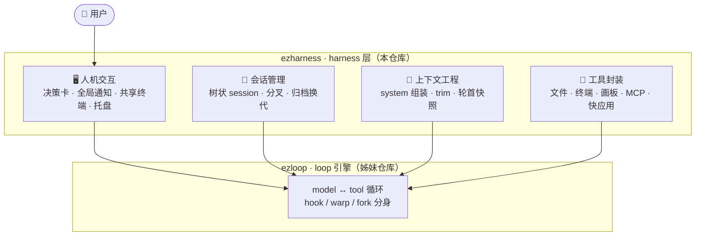
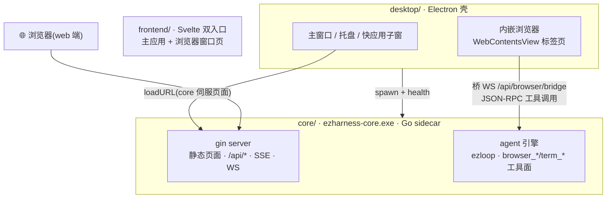
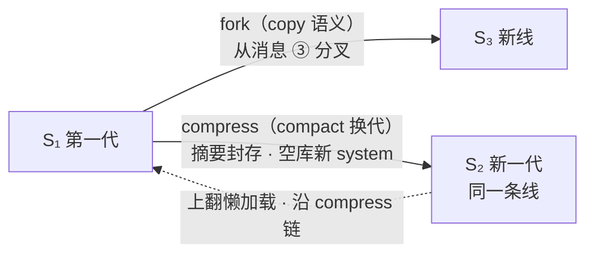

<div align="center">


# ezharness

**简单，交给用户。**

一个 exe · 三重角色 · 零配置 —— 为用户提供最简单交互方案的桌面智能体 harness

[](https://go.dev)
[](https://svelte.dev)
[](https://www.electronjs.org/)
[](https://github.com/xuanlv2002/ezharness/releases)
[](LICENSE)

*上下文工程管模型看什么，工具封装管 agent 能做什么，人机交互管用户怎么省心。*

</div>

---

## 设计理念

ezharness 认为一个助手类 harness 只需做好三件事，其余一切设计都面向用户简化：

| 支柱 | 关注点 |
|---|---|
| **上下文工程** | 什么进上下文、何时折叠、如何让模型始终知道自己是谁、在哪、用户最近干了什么 |
| **工具封装** | 把系统能力（文件、终端、画板、MCP…）封装成安全可控、即取即用的工具 |
| **产品交互方案设计** | 人机协同的交互面：决策、通知、共享终端——对话之外的通道 |



与 [ezloop](https://github.com/xuanlv2002/ezloop) 的分工：ezloop 是精简的 agent loop 框架，只负责核心循环；ezharness 在其上做**会话管理、上下文工程设计、工具封装、人机交互设计**。

三条产品原则：

1. **对话不是唯一的通道** —— 决策、观察、操作各有专门的产品面；通知全局可达，数据不绑视图。
2. **状态即消息** —— 会话的全部状态是可落盘的消息库与 system；重启即恢复，上下文折叠不丢档。
3. **一切面向用户简化** —— 零配置可启动、文件夹即存储、桌面窗口与浏览器同一份页面、agent 需要人时跨分支把通知送到眼前。

## 快速开始

从 [Releases](https://github.com/xuanlv2002/ezharness/releases) 下载，两种方式任选其一（**exe 在哪运行，配置与数据就在哪生成**）：

**方式一：绿色版（下载 exe）**

1. 下载绿色版 `ezharness-v<版本>.exe`（可改名 `ezharness.exe`），放入任意文件夹（如 `D:\ezharness`）；
2. 将该文件夹加入 PATH 环境变量；
3. 任意终端输入 `ezharness` 启动。首次运行在同目录自动生成 `ezharness.json` 与 `data\`。

**方式二：安装包（下载 installer.exe）**

1. 下载安装包，双击运行；
2. 按引导选择安装目录，自动创建开始菜单与桌面快捷方式，可选「添加到 PATH」。

首次启动到「模型」页填 apiKey 后即可对话。纯 server 形态（无桌面壳，浏览器访问）：直接运行 `ezharness-core.exe` 后访问 `http://127.0.0.1:<port>`——与桌面端同一份页面（浏览器控制等桌面专属能力自动降级）。

## 架构

三层结构：Electron 桌面壳 + Go sidecar 后端 + 端无关前端页面；桌面端与 web 端访问的是同一个 core 服务：



- core：Go + gin，三层 MVC（controller → service → domain），业务全在这里；桌面专属能力（内嵌浏览器）经桥协议接入，端无关
- desktop：Electron 壳——窗口/托盘/生命周期 + 浏览器资产（WebContentsView，AI 经桥控制、用户原生操作）
- frontend：Svelte 5 + Vite + TypeScript，core 伺服（同源 REST/SSE/WS），web 端自动降级
- 监听默认 `127.0.0.1`（不触发防火墙弹窗）；`exe 在哪运行，配置与数据就在哪生成`

## 核心能力

| 模块 | 说明 |
|---|---|
| 会话 | 树状管理：多线并行、从任意消息分叉、上下文归档换代、分身并行子任务 |
| 对话 | SSE 流式时间线，跨分支全局通知，审批/询问决策卡 |
| 安全 | 四档审批策略（每次审批/黑名单/白名单/全部免审），即时生效 |
| 模型 | 四槽单选：main / vision / image / audio，各自带用量统计 |
| 记忆 | 长期记忆（索引入上下文，按需检索）/ 能力记忆（skill）/ 话题记忆（会话存档） |
| 终端 | 人机共享真实 shell：agent 干活你随时接管，你敲的命令 agent 知道 |
| 快应用 | agent 生成的小工具（html 等）一键启动为子窗口 |
| MCP | 外部工具服务器：http/stdio，探活、启停、热加载 |
| 魔法画板 | 对象模型白板：标注截图、白板创作，所见即所得回填为附件 |

## 深入设计

### 树状会话（[docs/sessions.md](docs/sessions.md)）

会话数据组织成一颗树：**节点是 session（一次换代内的完整对话库），线是用户视角的「会话」**。树对用户只露两个操作——



- **fork 分叉**：复制 `[0, anchor]` 前缀为完整副本开新线，删源不伤分叉
- **compact 换代**：摘要模型生成前情（2 分钟预算，原子锁防并发）→ 旧库封存只读 → 新库空消息 + 摘要 system → 内存热切换，前端无感
- **线间并发**：切线不取消后台分支的运行轮，切回时重建现场
- trim 是模型侧上下文整理（就地折叠不换库），archive 是用户侧会话树管理（换代封存）

### 上下文工程（[docs/context.md](docs/context.md)）

一条线同一时刻只有一个活跃上下文（system + 消息库视图）：

- **system 两段式**：`base`（人格 + workspace 架构 + 记忆索引 + skills / mcp 清单）+ `identity`（会话 ID 与存档路径——trim 折叠后模型的回忆入口），每 session 组装一次并固定
- **trim 双触发**：水位自动（超窗口 75%，可配）+ 模型主动 `trim_context` 工具；摘要折叠段 → `[head, tail, marker]` 截断，孤儿 tool 前移保证配对完整
- **agent_status 轮首快照**：每轮注入时间、水位、建议 compact、资源变更（用户在终端干了什么）——不是状态机，是快照记录
- **guard 兜底**：按窗口余量动态卸载放不下的工具结果，trim 没来得及跑也不会溢出

### 人机交互（[docs/interaction.md](docs/interaction.md)）

把人机协同交互工具**外置**——不塞进对话流硬凑，做成独立的产品面：

- **决策链路**：四档审批策略（ask/black/white/auto，人机与内部工具恒免审），DecisionCard 嵌时间线，断线可重放
- **全局通知栏**：汇总所有分支（含后台分支与分身）的未决请求——agent 需要人时一定能找到人；内联直接决策
- **共享终端**：人机共用同一个真实 shell（ConPTY 全局池），`readMark` 单游标读即消费；用户手敲的命令进 agent_status——agent 每轮知道你在终端干了什么
- **共享浏览器**：desktop 内嵌真实 Chromium（每标签独立视图），AI 经桥控制、用户原生接管同一页面；`browser_start` 自动弹出共见

## 开发

前置依赖：[Go](https://go.dev/dl/)、[Node.js](https://nodejs.org/)、[Task](https://taskfile.dev/)；ezloop 作为普通 Go 模块自动拉取（本地开发走 replace）。desktop 依赖首次 `cd desktop && npm install`（国内可设 `ELECTRON_MIRROR=https://npmmirror.com/mirrors/electron/`）。

日常用两个脚本（[script/](script/)），从任意目录调用均可：

```sh
script\dev.bat           # 开发调试：vite 热更 + Electron 壳（core 用已构建 exe）
script\release.bat       # 发布：前端+core 全量构建 -> electron-builder 出 desktop\release\ 安装包
```

- 应用根 = core exe 所在目录：首次启动自动创建 `ezharness.json` 与 `data/`，零配置可用；开发 exe 构建在仓库根，与产品行为完全一致
- 设置页改端口/数据目录后进程内换代重启：收尾运行轮落盘 → chdir → 重建 Hub/Router

## 文档

- **[docs/index.html](docs/index.html)** — 项目主页（设计理念 · 树状会话 · 上下文工程 · 人机交互 · 架构与构建）
- [docs/sessions.md](docs/sessions.md) — 树状 session 管理
- [docs/context.md](docs/context.md) — 单上下文管理（trim / agent_status / 事件流）
- [docs/interaction.md](docs/interaction.md) — 以人为核心的人机交互设计
- [docs/build.md](docs/build.md) — 构建方案设计
- [AGENTS.md](AGENTS.md) — 开发备忘与踩坑清单

---

<div align="center">

**ezharness** — 简单，交给用户。

</div>
