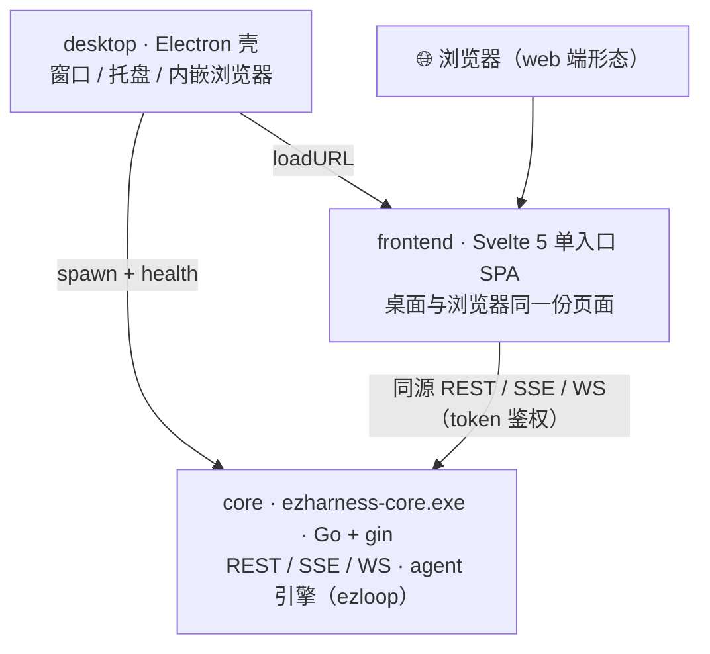

<!-- GIF 清单（补图后自动展示）：docs/gif/overview.gif · first-chat.gif · fork.gif ·
     terminal.gif · browser.gif · board.gif · quickapp.gif · decision.gif -->

<div align="center">


# ezharness

**简单，交给用户。**

一个 exe · 三重角色 · 零配置 —— 为用户提供最简单交互方案的桌面智能体 harness

[](https://github.com/xuanlv2002/ezharness/releases)
[](https://github.com/xuanlv2002/ezharness/releases)
[](LICENSE)
[](https://xuanlv2002.github.io/ezharness/)
[](https://go.dev)
[](https://svelte.dev)
[](https://www.electronjs.org/)

**简体中文** · [English](README.en.md)

</div>

---

ezharness 是一个跑在你电脑上的 AI 助手：它能读写整台设备的文件、操作真实终端与浏览器，同时把每一步都摊开给你看、随时交还给你管。它相信助手类 harness 只需做好三件事——

| 支柱 | 关注点 |
|---|---|
| **上下文工程** | 什么进上下文、何时折叠、如何让模型始终知道自己是谁、在哪、用户最近干了什么 |
| **工具封装** | 把系统能力（文件、终端、浏览器、画板、MCP…）封装成安全可控、即取即用的工具 |
| **产品交互方案设计** | 人机协同的交互面：决策卡、全局通知、共享终端与浏览器——对话之外的通道 |


## 特性

- **树状会话** —— 多线并行；从任意消息分叉（fork）探索不同方案；上下文归档换代（compact）沉淀记忆不丢档；切线不打断后台运行
- **人机协同终端** —— 人机共用同一个真实 shell：agent 干活你随时接管，你敲的命令 agent 下一轮就知道
- **共享浏览器** —— 桌面端内嵌真实 Chromium：AI 经工具操作、你在同一页面原生接管，所见即所得
- **决策卡与全局通知** —— 四档审批策略（每次审批 / 黑名单 / 白名单 / 全免审）即时生效；任何分支需要人时，通知一定能找到你
- **魔法画板** —— 对象模型白板：标注截图、白板创作，所见即所得回填为对话附件
- **快应用** —— agent 生成的小工具（html 等）一键启动为独立子窗口，可直接调用 MCP 工具
- **MCP** —— 外部工具服务器（http / stdio）：探活、启停、热加载
- **记忆三件套** —— 长期记忆（索引进上下文，按需检索）/ 能力记忆（skill 技能库）/ 话题记忆（会话归档）
- **模型四槽** —— main / vision / image / audio 单选槽位，各自带用量统计
- **安全** —— 全 API 令牌鉴权 + 同源放行；工具审批四档；终端命令包含匹配拦截（宁误拦不漏拦）

## 安装

从 [Releases](https://github.com/xuanlv2002/ezharness/releases) 下载，两种方式任选其一（**exe 在哪运行，配置与数据就在哪生成**）：

**方式一：绿色版（免安装）**

1. 下载 `ezharness-v<版本>.exe`（可改名 `ezharness.exe`），放入任意文件夹（如 `D:\ezharness`）；
2. 将该文件夹加入 PATH 环境变量；
3. 任意终端输入 `ezharness` 启动，首次运行在同目录自动生成 `ezharness.json` 与 `data\`。

**方式二：安装包**

1. 下载安装包并运行；
2. 按引导选择安装目录，自动创建开始菜单与桌面快捷方式，可选「添加到 PATH」。

**方式三：纯 server 形态（无桌面壳）**

直接运行 `ezharness-core.exe`，浏览器访问 `http://127.0.0.1:<port>`——与桌面端同一份页面（浏览器控制等桌面专属能力自动降级）。

## 30 秒上手

1. 启动后进入「模型」页，填入 apiKey，选择模型；
2. 回到对话页，把任务交给它——文件整理、脚本编写、报错排查、网页操作都行；
3. agent 需要你的时候（审批 / 提问），决策卡会出现在时间线与右上角通知栏。


## 核心玩法

| 场景 | 怎么玩 |
|---|---|
| [会话分叉](docs/md/session.md) | 对任意消息点「分叉」复制前缀开新线，多方案并行对比；「归档」把长对话沉淀为记忆并换代 |
| [共享终端](docs/interaction.md) | 工作区抽屉拉开终端：agent 正在跑的命令你能看见、能接管；你敲的命令它知道 |
| 共享浏览器 | 让 agent「打开某网页操作」，浏览器窗口自动弹出共见；你在同一页面随时接管 |
| 魔法画板 | 丢一张截图进画板，圈注要改的地方，一键回填给 agent |
| [快应用](docs/md/runtime.md) | 让 agent「做个小工具页面」，生成后一键启动为子窗口 |
| [MCP](docs/md/architecture.md) | 设置页添加 MCP server，agent 自动发现工具；快应用也能直调 |


## 架构一瞥

三层结构，业务全在一个 Go sidecar 里，桌面壳只做壳：


```mermaid
flowchart TB
    DESK["desktop · Electron 壳<br/>窗口 / 托盘 / 内嵌浏览器"] -- "spawn + health" --> CORE
    CORE["core · ezharness-core.exe · Go + gin<br/>REST / SSE / WS · agent 引擎（ezloop）"]
    FE["frontend · Svelte 5 单入口 SPA<br/>桌面与浏览器同一份页面"]
    WEB["🌐 浏览器（web 端形态）"]
    DESK -- "loadURL" --> FE
    WEB --> FE
    FE -- "同源 REST / SSE / WS（token 鉴权）" --> CORE
```

与姊妹仓库 [ezloop](https://github.com/xuanlv2002/ezloop) 的分工：ezloop 是精简的 agent loop 引擎（模型↔工具循环、hook / warp 扩展点、fork 分身）；ezharness 在其上做会话管理、上下文工程、工具封装与人机交互设计。

## 文档

**[在线文档](https://xuanlv2002.github.io/ezharness/)**（支持中英文切换，按由浅入深组织）：

| 层 | 内容 | 入口 |
|---|---|---|
| 快速上手 | 安装、配置模型、第一轮对话 | 本页 + [快速上手](https://xuanlv2002.github.io/ezharness/#start) |
| 用户指南 | 会话 / 终端 / 浏览器 / 画板 / 快应用 / MCP 各功能面 | [用户指南](https://xuanlv2002.github.io/ezharness/#guide) |
| 核心概念 | 树状会话、上下文工程、人机协同交互 | [核心概念](https://xuanlv2002.github.io/ezharness/#concepts) · [interaction.md](docs/interaction.md) |
| 深入设计 | 架构、hook 全景、存储格式、上下文全动作 | [架构深读](https://xuanlv2002.github.io/ezharness/architecture.html) · [docs/md/](docs/md/) |
| 参考 | 构建方案、开发备忘 | [build.md](docs/build.md) · [AGENTS.md](AGENTS.md) |

## 从源码构建

前置依赖：[Go](https://go.dev/dl/)、[Node.js](https://nodejs.org/)（含 npm）。要改 [ezloop](https://github.com/xuanlv2002/ezloop) 本身时（发布版从模块代理拉取，够用则不必克隆），`core/go.mod` 用 `replace` 指向本地 ezloop 仓库。Electron 下载已配 npmmirror 镜像（`desktop/.npmrc`）。

版本单源 `script/version.yaml`（release.bat 同步页脚与打包版本）。脚本从任意目录调用均可：

```sh
script\dev.bat           # 调试：前端构建 + core 编译（bin\）-> npm run start 前台跑 Electron
script\release.bat       # 发布打包 -> release\v<版本>\ 安装包 + 绿色版
```

## 贡献

欢迎 issue 与 PR。改动前请先读 [AGENTS.md](AGENTS.md)（开发备忘：变更连带检查清单与易踩的坑），深读设计见[在线文档](https://xuanlv2002.github.io/ezharness/)。

## 许可

[Apache-2.0](LICENSE)

---

<div align="center">

**ezharness** — 简单，交给用户。

</div>
