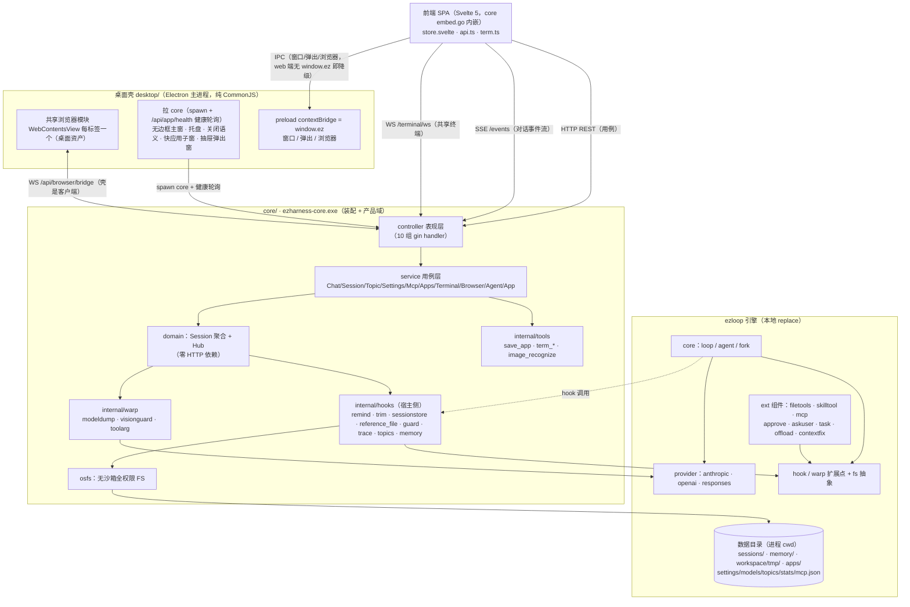

# 系统整体架构

ezharness：基于 ezloop 内核的桌面 agent harness（gin + 三层 MVC）。启动即对本机全权（文件不限目录 + 原生 shell）。

**形态是一个整体，不是三个可以各自独立运行的东西**：`desktop/`（Electron 壳）拉起 `core`（Go sidecar），core 伺服 `frontend`（端无关页面）——桌面窗口与浏览器访问的是**同一份页面、同一个 core 服务**，壳负责窗口/托盘/内嵌浏览器这些桌面专属资产，core 负责全部业务，前端只认 HTTP 与 `window.ez` 的有无。core 也能单独运行（浏览器访问 `http://127.0.0.1:<port>`），此时桌面专属能力自动降级。

## 〇、总图



## 一、双仓库

| 仓库 | 角色 |
|---|---|
| **ezloop**（`github.com/xuanlv2002/ezloop`，本地 `../ezloop`） | agent 引擎：core 循环（loop/agent）、provider（anthropic/openai/responses 三协议）、hook/warp 扩展点、ext 通用组件（filetools/skilltool/mcp/approve/askuser/task/offload/contextfix） |
| **ezharness**（本仓库） | 宿主应用：装配（选 hook、传参数）+ 产品域（会话树/设置/终端/快应用/前端）+ 自有 hooks（remind/trim/sessionstore 等，依赖 session 状态的留在此侧，见 hooks.md 分界判据） |

要改 ezloop 本身时，ezharness 的 go.mod `replace` 指向本地 ezloop（发布前 ezloop 升版本、再移除 replace）；不启用 replace 时编译用的是 module cache 里的已发布版本。

## 二、应用生命周期

一次启动是**两条并行的启动序列**，壳先起、core 就绪后壳才开窗：

```
desktop（Electron 主进程）
 ├─ 读配置目录 ezharness.json 取端口（缺失回落 5260）
 ├─ spawn core：bin/ezharness-core.exe（打包后 resources/，EZHARNESS_CORE_EXE 可覆盖）
 │    portable 绿色版追加 --root <exe 目录>（配置/数据锚在 exe 旁而非自解压临时目录）
 ├─ 健康轮询 GET /api/app/health（300ms 一次，30s 超时即退出）
 ├─ createMainWindow()  loadURL http://127.0.0.1:<port>/?desktop=1   ← 同一份 core 伺服页面
 ├─ createTray() · registerIpc() · startBrowserModule()（浏览器桥 WS 客户端）
 └─ 退出：quitApp() → coreProc.kill() → app.quit()（core 异常退出则壳跟着退出）

core（go run / ezharness-core.exe）
 ├─ config.Load()            读应用根 ezharness.json（缺失建默认）
 ├─ newApp(cfg)              adoptLegacy 收编旧数据 → MkdirAll → os.Chdir(数据目录)   ← 进程 cwd = 数据根
 ├─ a.start()                net.Listen 预占端口 → buildRouter() → srv.Serve
 └─ 等 SIGINT/SIGTERM → stop()
```

- **buildRouter 换代重建**：`domain.NewHub()`（含 bootstrap 恢复）→ TerminalService → AgentService.Assemble → 全部 controller。设置页改端口/数据目录触发**换代**（restart）：`shutdownGeneration`（杀终端 shell → 取消运行轮并等落盘 → 关 server）→ syncDrained（收尾数据同步新目录）→ chdir → buildRouter。`boot` 代际计数跨代共享，前端据此判断新服务就绪并跳新端口——**换代发生在 core 进程内，壳不重启 core**。
- **退出顺序**同理：轮内历史只在 OnEnd 落盘，不等落盘直接退出会丢整轮；SSE 长连直接 `srv.Close()`（优雅 Shutdown 会拖满超时）。壳关闭时先 `coreProc.kill()`，core 自己走 stop() 收尾。
- **应用根 = core exe 所在目录**（`config.Root()`，sync.Once 锚定，不受后续 chdir 影响）——exe 在哪运行，ezharness.json 与数据目录就在哪生成（安装版与自编译同规则）；portable 绿色版自解压到临时目录，靠 `PORTABLE_EXECUTABLE_DIR` 把配置/数据锚回 exe 旁（同时作为 core 的 `--root`）。

## 三、分层结构

三部分的职责边界（**一个产品，各管一段，互不越界**）：

| 部分 | 目录 | 管什么 | 不管什么 |
|---|---|---|---|
| 桌面壳 | `desktop/` | 进程生命周期（拉 core / 健康检查 / 退出）、窗口与托盘、关闭语义、快应用子窗、抽屉弹出窗（tear-off）、共享浏览器（WebContentsView）、`window.ez` IPC | 任何业务与数据 |
| core | `core/` | 全部业务与服务：会话/分支/设置/MCP/终端/快应用、agent 装配、数据落盘 | 窗口与桌面 API |
| 前端 | `frontend/` | 页面与交互；只依赖 HTTP/SSE/WS + `window.ez` 的有无 | 不知道自己在哪个壳里（端无关） |

core 内部分层：**controller（表现）→ service（用例）→ domain（会话聚合与事件）**，tools/hooks 为领域扩展，osfs/config 为基础设施，main 只做装配。

| 包 | 职责 |
|---|---|
| `internal/controller` | gin handler 只做绑定、校验与响应，业务在 service |
| `internal/service` | ChatService（发送/取消/决策/事件流消费）、SessionService（bootstrap/状态/历史/摘要）、TopicService（新建/fork/切换/归档换代）、SettingsService + MemoryService、McpService、AppsService、TerminalService（共享终端公共池：ConPTY，用户 WS 与 AI term_* 共写）、BrowserService（共享浏览器 core 侧：经 `/api/browser/bridge` 把 `browser_*` 转发给桌面壳执行）、AgentService（agent 装配中枢）、AppService（配置/迁移/换代/boot） |
| `internal/domain` | Session（会话聚合并发状态机）+ Hub（全局容器）+ 事件帧，零 HTTP 依赖 |
| `internal/hooks` | 宿主侧 hook：sessionstore（落盘）、sysprompt、trim、remind+reschange（系统提醒）、reference_file（引用告知）、guard、trace、topics、memory、archive、summarize、recall（预留） |
| `internal/tools` | 自有工具：save_app、term_*（共享终端）、image_recognize（识别槽） |
| `internal/warp` | 装饰器：modeldump（调试打印）、visionguard（无视觉剥图）、toolarg（参数语法糖） |
| `internal/osfs` | 无沙箱全权限文件系统（直连 os，不委托 fs.NewLocal——根挂载前缀检查会误杀） |
| `internal/config` | ezharness.json（端口/监听/数据目录/窗口尺寸） |

### 进程与线程模型

一次运行的 OS 进程（都由这份代码显式派生）：

| 进程 | 数量 | 谁拉起 | 职责 |
|---|---|---|---|
| Electron 主进程（壳） | 1 | 用户启动 `ezharness.exe` | 拉 core、窗口/托盘/IPC、浏览器模块 |
| renderer | 每个 BrowserWindow / WebContentsView 一个 | Electron | 页面：主窗、快应用子窗、抽屉弹出窗；浏览器标签各自独立 renderer |
| core | 1 | 壳 spawn（或单独运行） | 全部业务 + gin server |
| ConPTY shell（cmd.exe / sh） | 每个共享终端一个 | core（go-pty） | 用户与 AI 共写的真实终端 |
| MCP stdio server（npx/uvx…） | 每个启用的 stdio server 一个 | core 侧 mcp hook | MCP 工具进程 |
| `taskkill` | 瞬时 | core（关终端 / 取消命令） | 杀 shell 进程树 |

core 进程内并发靠 goroutine：一轮 chat 一个运行 goroutine（引擎循环）、每个终端 `readPump`+`waitPump` 两个常驻 goroutine、WS 每连接一个读写泵。
前端是单线程：无 Web Worker / Service Worker；SSE 与终端 WS 各一条常驻连接（终端 WS 单连接多路复用全部终端，xterm 实例 keep-alive），浏览器标签的真实页面在**另一个 renderer**，与抽屉 UI 之间只走 IPC。

## 四、数据目录布局

进程 cwd = 数据目录（启动 chdir；位置由 ezharness.json 的 dataDir 决定，空 = 应用根下 `data/`）。ezloop 各 hook 的相对路径存储自动落此。

| 路径（相对 cwd） | 内容 | 读/写方 |
|---|---|---|
| `ezharness.json`（**在应用根**） | 端口/监听/数据目录/窗口尺寸 | config；AppService 换代时改写 |
| `settings.json` | 运行配置（WorkDir/TrimPercent/MaxIterations/DisabledSkills…） | ensureSettings / SettingsService |
| `models.json` | 模型四槽（main/vision…，端点凭证 + 用量累计） | Hub.RecordUsage 每轮落盘 |
| `toolRules.json` | 工具审批策略 | SettingsService |
| `topics.json` | 分支（线）索引 | hooks.Topics |
| `stats.json` | 跨会话生命体征（累计 usage/轮数） | Stats |
| `mcp.json` | MCP server 配置 | McpService 写；McpHook 读（热加载） |
| `sessions/<id>/` | 会话存档（见 session.md） | sessionstore |
| `memory/longterm/harness.md` | 长期记忆索引（初始进上下文） | EnsureHarnessMd / agent 维护 |
| `memory/skills/` | 技能库（SKILL.md + scripts/） | CreateSkill/Delete / skilltool |
| `apps/` | 快应用 html（save_app 生成） | 静态服务 `/apps/*` |
| `workspace/` | 工作目录（settings.WorkDir 空 = 此默认） | agent 自由读写 |
| `workspace/tmp/` | 用户上传附件暂存（base64 不入上下文） | ChatService 落盘 / read_file 读 |
| `.ezloop/offload/` | 大工具结果卸载区 | offload / guard |

system prompt 的 `<workspace>` 段把此布局（绝对路径）原样告知模型。

## 五、通信通道

页面与 core 之间是**同源直连**（窗口 `loadURL` 到 core 端口，前端一律相对路径 `/api/...`，不写死端口；dev 可 `EZHARNESS_DEV_URL` 指向 vite，由 vite 把 `/api` 与 WS 代理到 core）：

| 通道 | 端点 | 承担 |
|---|---|---|
| **HTTP REST** | gin，默认 `127.0.0.1:5260`（可配 0.0.0.0 局域网） | 全部用例操作（会话/设置/模型/分支/mcp/apps/前端静态/工作目录文件读写） |
| **SSE** | `GET /api/sessions/:id/events` | 对话事件流（`{type,ts,iter,forkId,data}` 帧）；建连重放（轮进行中回放整轮聚合帧）；断线 pending 补偿 |
| **WS · 终端** | `GET /api/terminal/ws` | 魔法看板共享终端：单连接多路复用全部终端（帧带 id 路由），hello 帧带各终端快照，重连即恢复 |

另有两条**跨进程通道**，只在桌面形态下存在（web 端访问 core 时自动缺省）：

| 通道 | 两端 | 承担 |
|---|---|---|
| **IPC** | 前端 ↔ Electron 主进程（preload 暴露 `window.ez`） | 窗口控制（最小化/最大化/关闭询问）、抽屉工具弹出窗与拖拽脱离、快应用子窗、浏览器标签操作。**前端所有调用点判空降级**，web 端无 `window.ez` 即不可用 |
| **WS · 浏览器桥** | core（客户端）↔ Electron 浏览器模块 | `GET /api/browser/bridge`：core 把 `browser_*` 工具调用编成 JSON 帧推给壳，壳在 WebContentsView 上执行后回执；桥未连接时工具报「需要 desktop 桌面端」 |

前端 Svelte 5（runes）+ Vite，**单入口 SPA**、**手写 fetch 层**（无框架 bindings；产物恒内嵌 `core/embed.go`，无 build tag 开关）；多窗口/多形态不是多入口，而是同一页面按 query 分流：`?desktop=1` 判定桌面形态，`&popout=term|file|browser` 只渲染单个 pane。全局状态单例 `store.svelte.ts`；事件归约与渲染见 frontend.md。

## 相关文档

- **session.md** — session 设计与 session 树
- **context.md** — 一份完整上下文的逐条标注：system 的组成与来源、每轮标签的生成者与条件
- **runtime.md** — agent 运行时组成与一轮 chat 全流程
- **frontend.md** — 前端事件定义与渲染
- **hooks.md** — hook/warp 封装原则与分界判据
