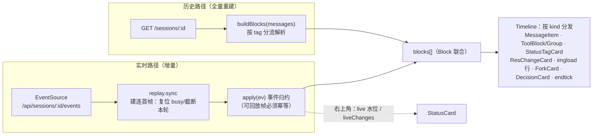

# 前端：事件定义与渲染

Svelte 5（runes）+ Vite，手写 fetch 层（无 wails bindings），全局单例 `store.svelte.ts`。时间线渲染是**双路径同构**：实时 SSE 事件归约（apply）与历史重载解析（buildBlocks）产出同一套 Block，渲染组件不区分来源。

两路径何时触发：实时=轮进行中；历史=刷新、切换分支/会话、分身抽屉打开、compact 换代后。

## 一、SSE 事件全集与前端归约

事件帧 `{type, ts, iter, forkId?, data?}`；`forkId` 非空 = task 分身事件（进分身聊天框，不入主线）。**回放性**：`replayable` 排除的高频/瞬态帧不进 turnFrames 缓存（断线重连不重放，靠 replay.sync 截断 + 历史兜底）。

| 事件 | Data | 可回放 | apply 行为 |
|---|---|---|---|
| `replay.sync` | `{turnActive}` | 建连首帧 | 权威复位 busy / 截断本轮块（防重复） |
| `loop_start` | 输入文本 | ✓ | 本地已 push 同文本则跳过，否则补 push user 块；清 liveChanges |
| `model_start` / `model_end` | — / ModelEndData{content,toolCalls,usage} | ✗/✓ | 思考指示 / 关闭 streaming、水位累计 |
| `model_chunk` / `reasoning_chunk` | 增量文本 | ✗ | appendDelta 到 streaming assistant 块 |
| `tool_chunk` | ToolCallDelta | ✗ | 流式构造工具参数（building 态） |
| `tool_start` / `tool_end` | {callId,name,args} / {callId,content,err} | ✓ | 工具卡 building→running→done，结果回填 |
| `approve.request` / `askuser.request` | ToolCall | ✓(pending) | 决策卡/提问卡 |
| `decision.resolved` | {id,resolution} | — | 回放纠正：移除已决卡 |
| `task.start` / `task.end` | {id,task} / {id,answer…} | ✓ | 分身入口卡 + ensureFork |
| `status.snapshot` | StatusData{now,ctxTokens,ctxWindow,suggestCompact} | **✗** | 右上角水位条；仅 suggestCompact 时插状态卡（本轮 user 块前） |
| `res.change` | string[] 变更条目 | **✗** | 资源变更卡（本轮 user 块前）+ liveChanges（右上角行） |
| `filetools.image_loaded` | string[] 图片路径 | ✗ | imgload 块（缩略图走 `/api/workspace/file?path=`） |
| `session.compacting` / `session.trimming` | 提示文本 | — | note 块（归档/整理进行中） |
| `session.trim` | TrimInfo{folded,kept} | — | note 块（整理完成分割线） |
| `session.compact` | CompactInfo{oldId,newId,summary…} | — | note 块 + 换叶刷新（live/liveChanges 清空） |
| `error` | 文本 | — | ⚠ assistant 块 |
| `turn_end` | {stopReason,usage,iterations,err,elapsedMs} | **✗（永不回放）** | busy=false + endtick 块 + 水位/分支刷新 |

**改事件协议检查三处**：后端 `MapEvent`（event.go）、`replayable` 名单（session.go）、前端 `apply` case（含幂等性——所有可回放帧的 apply 必须幂等）。

## 二、历史重载（buildBlocks 解析规则）

按消息角色分流，**分支顺序敏感**（标签识别在通用 user 分支之前）：

| 消息特征 | 产出块 |
|---|---|
| user 含 `<agent_status>`（旧 JSON / 新中文文本） | `status` 块——仅含关键词"整理上下文"才入时间线，普通轮次只进右上角 |
| user 含 `<res_change>` | `reschange` 块（matchAll `/^- (.+)$/gm` 取条目） |
| user 含 `<upload_file>` | 路径暂存，挂到**下一个真实 user 块**的 files（附件 chips） |
| user 含 `<image_loaded>`（包裹标签） | `imgload` 块（paths + images base64） |
| user 含 `<end_reason>` | `endtick` 块（正则提取字段拼一行） |
| user 含 `<context_trim` | `note` 块（整理分割线） |
| 其他 user | `user` 块（text + images 旧格式展示 + files chips；owner/msgIdx 供分叉锚点） |
| assistant | `assistant` 块 + 展开 tool_calls 为 `tool` 块（task 调用后插 `fork` 入口卡） |
| tool | 按 callId 回填对应工具块结果 |

## 三、Block 类型全集与渲染组件

| kind | 数据 | 组件 |
|---|---|---|
| `user` | text/images/files | MessageItem（user 气泡 + 附件 chips + 旧图片网格） |
| `assistant` | text/reasoning/streaming | MessageItem（marked + DOMPurify；mermaid 后处理） |
| `tool` | id/name/args/result/err/state/decision | ToolBlock / ToolGroup（同名连续折叠） |
| `status` | text/data | StatusTagCard（水位警示行） |
| `reschange` | items | ResChangeCard（变更列表：新增/用户绿、移除/退出/关闭红） |
| `imgload` | paths/images | Timeline 内联（缩略图小行 + "已加载上下文"） |
| `fork` | forkId | ForkCard（分身入口，点击开抽屉） |
| `decision` | DecisionData | DecisionCard（审批/提问） |
| `note` | text | Timeline 内联（分割线/提示行） |
| `endtick` | icon/title | Timeline 内联（轮次收尾小图标） |

空状态判定排除 note/status/reschange/endtick/imgload（只剩系统记录仍展示欢迎页）。

## 四、特殊 tag 全表（前后端契约）

| tag | 生成者 | 模型可见 | 前端实时路径 | 前端历史路径 |
|---|---|---|---|---|
| `<agent_status>` | remind 快照段 | ✓（user 消息） | status.snapshot 事件 | 关键词"整理上下文" |
| `<res_change>` | remind 变更段 | ✓ | res.change 事件 | 标签 + `- ` 行 |
| `<upload_file>` | uploadfile hook | ✓ | send 响应回填 files 路径 | 标签 + `- ` 行 → 挂下个 user 块 |
| `<image_loaded>` 包裹标签 | filetools OnLoop | ✓（user 消息，Images 带 base64） | filetools.image_loaded 事件 | 标签体内路径行 + m.images |
| `<image_loaded path="…"/>` 自闭合 | read_file 工具结果 | ✓（tool 消息，保留不改写） | 工具卡结果文本 | 同左（不解析） |
| `<end_reason>` | remind 收尾段 | ✓ | turn_end 合成 endtick | 正则提取 |
| `<context_trim kept="N">` | trim hook | ✓（替代被折叠消息） | session.trim note | 标签 → note |
| `<$supper_url>…</$supper_url>` | 模型输出（占位语法，system workspace 段有指引） | ✓（正文） | marked extension 实时解析 | 同左（同一渲染管线） |
| ↳ 内容 `https://…` | 同上（外链） | ✓ | chip 点击经系统浏览器打开（复用外链拦截） | 同左 |
| ↳ 内容 `term://<终端id>` | 同上（终端入口） | ✓ | chip 点击 openTermAt：拉开终端抽屉并定位（TerminalTab 消费 store.termFocus） | 同左 |
| ↳ 内容 `app://<快应用名>` | 同上（快应用入口） | ✓ | chip 点击 POST /api/apps/open 开子窗 | 同左 |
| ↳ 内容 `file://<绝对路径>` | 同上（文本文件入口） | ✓ | chip 点击 openFileAt（文本白名单门禁 textfile.ts）：拉开抽屉文件页加载编辑（FilePane 消费 store.fileFocus；保存 POST /api/workspace/save） | 同左 |
| `<@toolArg>路径</@toolArg>` | 模型工具参数 | ✓（入史参数保持原文） | 工具卡显示原文 | 同左（展开只发生在执行侧） |

**改任一 tag 格式的连带清单**见 AGENTS.md 对应小节；行前缀 `- ` 与关键词"整理上下文"是硬契约。

## 五、其余前端机制速查

- **外链拦截**（main.ts 捕获阶段）：消息内 `http(s)` 外链桌面模式经 `/api/window/open-url` 系统浏览器打开（WebView 内导航会顶掉 SPA）；同源链接不拦
- **附件预览**：图片缩略图/文件查看走 `GET /api/workspace/file?path=<绝对路径>`（限工作目录内，防穿越）
- **SSE 单连接**：window 级 `__ezSSE`，切换分支重订阅（含该分支回放帧重放）
- **共享终端**：`/api/terminal/ws` 单 WS 多路复用，term.ts 独立于 store（xterm 实例管理）
