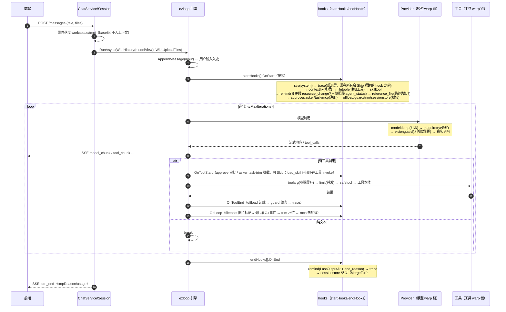
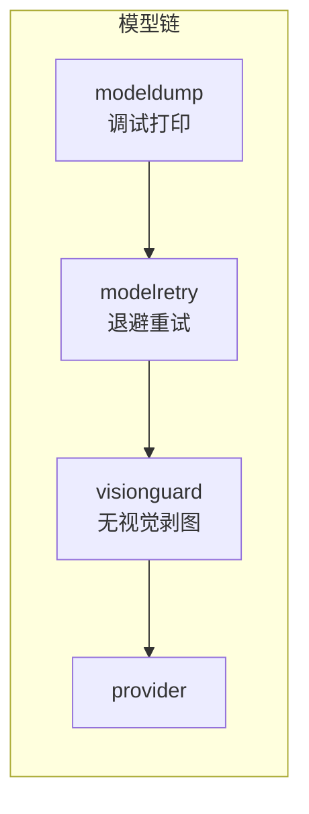
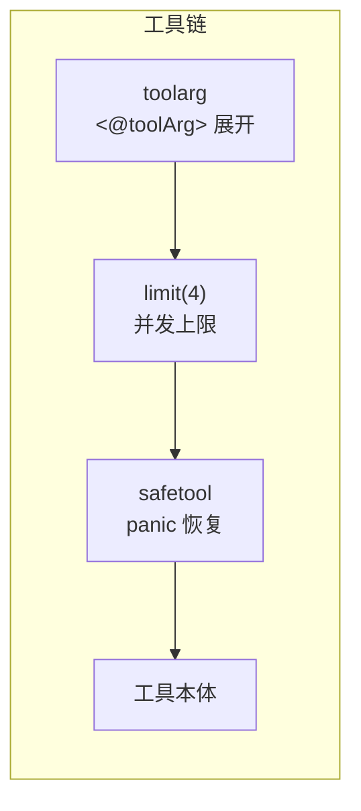

# 运行时：agent 组成与一轮 chat 的完整流程

每条 session 由 `AgentService.Assemble` 装配一个 agent 运行时：provider + 模型 warp 链 + 工具 warp 链 + 静态工具 + hooks 数组。本文档是装配全清单与执行时序。

## 〇、一轮 chat 的时序总图



warp 双链（先注册 = 外层，调用从左到右）：





## 一、hook 点（ezloop 引擎的 7 个扩展点）

| hook 点 | 触发时机 | 典型用途 |
|---|---|---|
| `OnStart` | Run 组装期一次（startHooks 按数组顺序） | 注入工具、修理历史、插轮首消息。**fork 不跑**（复刻时置 nil） |
| `OnModelStart` / `OnModelEnd` | 每次模型调用前/后 | 记录用量、可提前终止 |
| `OnToolStart` | 每个工具调用前，返回 Action 可短路（Proceed / Skip(result) / Abort） | 审批、人机提问、工具拦截 |
| `OnToolEnd` | 工具调用后、结果入史前 | 结果改写（卸载/截断） |
| `OnLoop` | 迭代回边（工具批执行完 → 下次模型调用前） | 图片消息转换、水位整理、配置热加载 |
| `OnEnd` | 轮结束（defer 语义，成败/取消都跑） | 收尾记录、落盘 |

**并发契约**：除 OnToolStart / OnToolEnd 在同轮多工具调用之间并发外，其余 hook 点引擎串行。`LoopState.Metadata` 是 Run 内跨 hook 共享通道（runOpts 写、hook 读）。

## 二、hooks 清单（15 个，装配顺序即执行顺序）

| # | hook | 来源 | hook 点 | 职责 |
|---|---|---|---|---|
| 1 | **sysprompt** | ezharness | OnStart（必须首位） | system 唯一来源：base（人格/workspace/memory/skills/mcp）+ identity + compact summary；session 创建组装一次，快照恢复不重组 |
| 2 | **trace** | ezharness | OnStart/OnModel*/OnTool*/OnEnd | otel 风格调用链（trace.jsonl：turn/model/tool/fork/compact span）。**toolStart 必须最前**——`approve`/`askuser`/`task` 在 OnToolStart 里返回 Skip 会短路后续 hook，观测层排在它们之后则那些调用没有 span |
| 3 | **contextfix** | ezloop | OnStart | 修理残缺历史（孤儿 tool_call 等协议不完整序列） |
| 4 | **filetools** | ezloop | OnStart + **OnLoop** | 注册 read/write/edit/terminal + 系统环境段；OnLoop 把 read_file 图片标记转换为持久化 user 图片消息 + 发 `filetools.image_loaded` 事件（见第五节） |
| 5 | **skilltool** | ezloop | OnStart | 注册 `load_skill`（工具 Invoke 闭环：渲染 SKILL.md 全文 + 目录树） |
| 6 | **remind** | ezharness | OnStart + OnEnd | 系统提醒三段：变更段（`<resource_change>` 按需、附 available 清单 + `resource.change` 事件）+ 快照段（`<agent_status>` 每轮 + `status.snapshot` 事件）；OnEnd 收尾 `<end_reason>` + LastOutputAt（变更检测细节在 reschange.go） |
| 7 | **reference_file** | ezharness | OnStart | 带引用轮次在输入前插 `<reference_file>`（附件=整文件引用只给路径；文件页标注=路径+片段行号+备注），无引用零消息 |
| 8 | **approve** | ezloop | OnStart + OnToolStart | 人机审批：规则匹配挂起等决策（SSE approve.request）；拒绝即 Skip |
| 9 | **askuser** | ezloop | OnStart + OnToolStart | `ask_user`：模型向用户提问，阻塞等回答 |
| 10 | **task** | ezloop | OnStart + OnToolStart | `task`：fork 分身子循环（独立 LoopState，事件带 forkId），answer 汇回 |
| 11 | **mcp** | ezloop（ezharness 包装） | OnStart + OnLoop | 注册 `mcp_router`（系统级单例注入：全部 session 与页面/API 共用 `service.NewMcpRouter` 的全局连接池，OnEnd 不关连接）；OnLoop 兜底热加载（mcp.json 手改；保存配置由 McpService.Update 即时替换） |
| 12 | **offload** | ezloop | OnToolEnd | >4096 字节工具结果卸载 `.ezloop/offload/`；豁免 ask_user/task/load_skill；read_file 是 ReplayTool |
| 13 | **guard** | ezharness | OnToolEnd | 窗口余量兜底：offload 豁免名单的大结果放不下时强制卸载（须在 offload 后） |
| 14 | **trim** | ezharness | OnLoop + OnToolStart | 上下文整理：水位自动（窗口 × TrimPercent%）+ 模型主动 `trim_context`（登记 pending 轮末执行）；就地截断 + 四节结构化摘要（已完成/正在做/待办/关键事实）+ 重写 `sessions/<id>/progress.md` + `<context_trim>` marker |
| 15 | **sessionstore** | ezharness（`s.Sess`） | OnStart + OnEnd（最后） | 持久化：OnEnd 把 MergeFull(历史)/基线/用量落 session.json（内存与磁盘同源，见 session.md） |

已实现未装配：`hooks/recall.go`（recall_topic 话题回顾）。分界判据（哪些留 ezharness、哪些下沉 ezloop）见 hooks.md。

## 三、warp 双链（先注册 = 外层）

| 链 | 层序 | 职责 |
|---|---|---|
| **模型链** | modeldump → modelretry → visionguard → provider | 全量输入调试打印（最外，重试不重打）→ 指数退避重试（流式已出 chunk 不重试）→ 无视觉模型剥请求图片 + `<image_loaded>` 注入 omitted 说明（**只改请求副本，历史不动**） |
| **工具链** | toolarg → limit(4) → safetool → 工具 | `<@toolArg>路径</@toolArg>` 执行前展开（入史参数保持原文）→ 同轮并发上限 → panic 恢复为 error |

warp 实例 per-Run 独立（fork 复刻 warp 链，分身输入同样可见）。

## 四、工具清单（16+1）

| 工具 | 提供方 |
|---|---|
| `read_file` / `write_file` / `edit_file` / `terminal` | filetools（read_file 图片走标记→OnLoop 图片消息） |
| `save_app` | ezharness tools（快应用生成） |
| `term_start` / `term_send` / `term_read` / `term_list` / `term_close` | ezharness tools（共享终端，全局资源） |
| `ask_user` / `task` / `mcp_router` | 对应 hook |
| `trim_context` | trim hook |
| `load_skill` | skilltool |
| `image_recognize` | ezharness tools（仅识别槽启用时装配） |

工具注册先 SetWarp 后 Register（两者都被包装；hook OnStart 里同名注册 = 覆盖）。

## 五、发起一个 chat 的完整流程

见第〇节时序总图（逐步：附件落盘 → RunAsync → input 入史 → startHooks 注入与插消息 → 迭代循环{模型 warp 链 / 工具 warp 链 / OnLoop} → endHooks 收尾落盘 → turn_end）。

## 六、上下文消息全表（模型看到什么）

| 消息 | 生成者 | 时机 | 内容 |
|---|---|---|---|
| system | sysprompt + 各 hook 追加 | 每 session 固定 | 人格 + `<workspace>` 可写位+行为规则 + `<memory>` 索引 + `<skills>`/`<mcp>` 清单 + `<action>` 行动准则 + `<output>` 输出规范 + identity + compact summary + tool-guide/系统环境段 |
| **用户真实输入** | 引擎 | 每轮末尾 | 文本（附件不在消息里） |
| `<agent_status>` | remind 快照段 | 每轮、输入前 | 当前时间 / 上下文水位（超 70% 附建议 trim）/ 距上次输出 |
| `<resource_change>` | remind 变更段 | **有变更才插**、agent_status 前 | 资源基线 diff 条目（`- ` 行）+ 变更后 available_skill/available_mcp 完整清单（`available_` 行，给模型即时发现资源） |
| `<reference_file>` | reference_file | **有引用才插**、输入前 | 本轮引用清单：`refs[].path`（整文件）或 `refs[].items[]`（片段行号+备注）；文件本体不进上下文 |
| `<image_loaded>` | filetools OnLoop | **读图才插**、工具批末 | 图片路径列表；消息 Images 带 base64（持久化） |
| assistant | 模型 | 迭代 | 正文 / tool_use（ToolCalls） |
| tool | 引擎 | 工具执行后 | 工具结果 string（含 read_file 的 `<image_loaded path=…/>` 机器标记，保留不改写） |
| `<end_reason>` | remind 收尾段 | 每轮末 | 轮次/时长/结束原因（compact 翻页自解释） |
| `<context_trim>` | trim | 整理时尾插 | 四节结构化摘要 + marker（替代被折叠的早期消息；同内容落 `sessions/<id>/progress.md`） |

轮序列示例（带附件+读图）：

```
<context_trim kept="4">四节结构化摘要（【已完成】【正在做】【待办】【关键事实】）…</context_trim>
[近几轮 …]
<resource_change>…</resource_change>  ← 有变更才有
<agent_status>…</agent_status>
<reference_file>…</reference_file>  ← 有引用才有
看下我发的截图                      ← 用户输入
assistant: [tool_use read_file]
tool:      <image_loaded path="…"/>
user:      <image_loaded>路径</image_loaded>   ← Images 带 base64
assistant: 这张图是…
<end_reason>…</end_reason>
```

## 相关文档

architecture.md（分层与数据目录）· context.md（完整上下文的逐条标注）· session.md（会话与树）· frontend.md（前端事件与渲染）· hooks.md（封装原则与分界判据）
