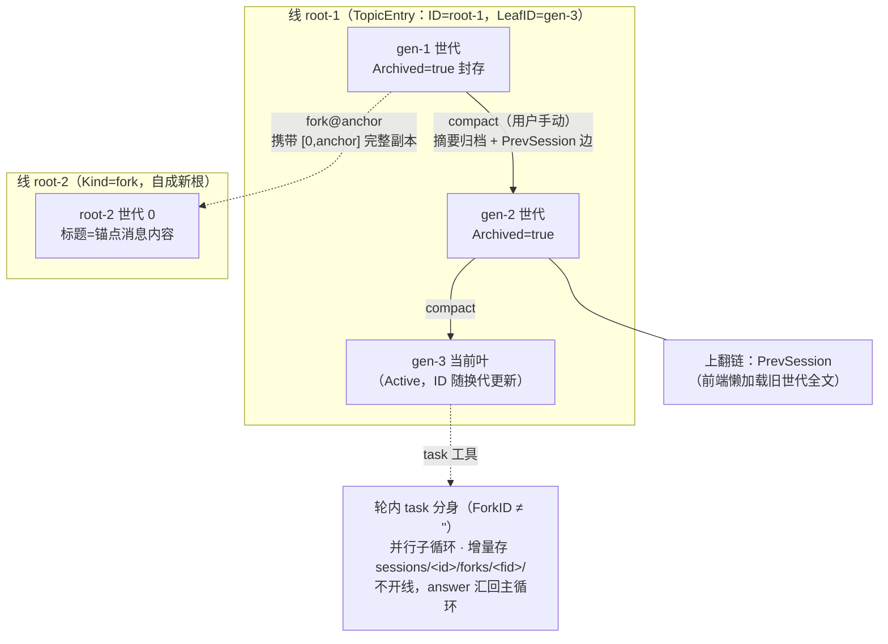
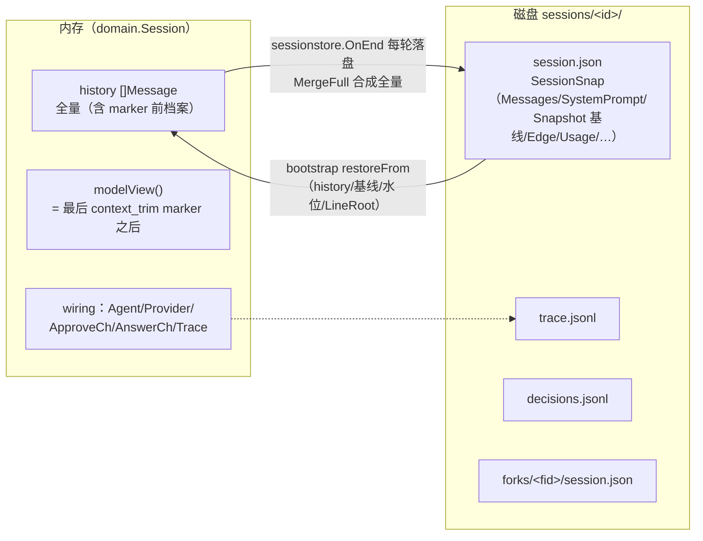

# Session 设计

一条 session 是一次会话聚合：内存运行时（domain.Session）+ 磁盘存档（sessions/<id>/session.json）。多个 session 世代构成 **session 树**（线 → compact 换代链 → fork 分叉），用户在"分支"（线）粒度上切换对话。

## 〇、总图：session 树



磁盘与内存的关系：



## 一、核心概念：ID / RootID / 世代 / 线

| 概念 | 含义 |
|---|---|
| **session 世代** | 一次 compact 归档产生一个新世代；每世代一个 `<id>`，各自有存档目录 |
| **ID** | 当前叶世代 ID（compact 换代随之更新） |
| **RootID（线根）** | 所属分支的稳定身份——Hub.branches 注册表键、前端路由、API `:id` 参数全用它；换代不换线 |
| **线（branch/topic）** | 同一 RootID 下的世代链 + 侧栏条目（topics.json 的 TopicEntry） |

## 二、Session 运行时（domain.Session）

| 字段 | 作用 |
|---|---|
| `ID` / `RootID` | 当前叶 / 线根（见上） |
| `Fsys` / `Sess` / `Topics` | osfs 实例 / sessionstore hook（落盘与快照）/ 线索引 |
| `history []types.Message` | 全量内存历史（含 trim marker 前的档案段） |
| `modelView()` | 发给模型的历史 = 最后 `<context_trim>` marker 之后（ViewStart）；system 由 sys hook 每轮重注，不随视图携带 |
| `wiring *Wiring` | 装配产物：Agent / Provider / ApproveCh / AnswerCh / ToolNames / Trace |
| `cur *runState` | 当前轮生命周期句柄 {ctx, cancel}；busy 语义 |
| `archiving` | 归档进行中锁（摘要最长 2 分钟）：锁发消息/切分支/二次归档 |
| `pending map[string]Event` | 未决人机请求（approve/askuser），SSE 断线重放 |
| `turnFrames [][]byte` | 本轮聚合帧缓存（刷新/重连回放重建时间线；轮开始清空；`replayable` 排除高频增量与 status.snapshot/resource.change/turn_end） |
| `subs` | SSE 订阅者通道（慢消费者丢帧，turn_end 校正兜底） |
| `snap *hooks.SessionSnap` | bootstrap 恢复的快照（Assemble 读取；nil = 新建） |
| `sysP *hooks.SysPrompt` | system 来源（session 创建组装一次；resume/compact 热更 summary 段） |
| `ctxTokens` | 上下文水位（事件消费侧 SetCtxTokens） |

关键方法：`StartRun`（busy/归档拒绝；WithHistory(modelView) + WithUploadFiles）→ `FinishRun`（`s.history = state.Messages`，trim 轮经 MergeFull 合成全量）→ `Publish`（pending + turnFrames + 扇出）。`SetIdentity`（换 ID 清水位）、`RotateTo`（换代：切 ID + 清历史 + 清水位）、`Shutdown`（取消并等落盘）。

## 三、磁盘存档：sessions/&lt;id&gt;/

```
sessions/<id>/
 ├─ session.json          可恢复快照（SessionSnap）
 ├─ trace.jsonl           调用链 span（Trace hook 全量重写）
 ├─ decisions.jsonl       人机决策记录（追加）
 └─ forks/<forkID>/session.json   task 分身增量存档（剥离 seed）
```

旧版平铺 `sessions/<id>.json` 不迁移不读取。**落盘时机 = OnEnd 每轮结束**（sessionstore 是 hooks 数组最后一位；失败不阻断，错误记 Metadata）。

### SessionSnap 关键字段

| 字段 | 作用 |
|---|---|
| `Messages` | 历史（剥离 system——systemPrompt 单独 pin） |
| `SystemPrompt` / `SystemBase` / `SummaryBlock` | 渲染后完整 system（恢复零逻辑）/ 基础段（人格+记忆+清单）/ compact 摘要段 |
| `PrevSession` / `CompactSummary` | compress 边：上一世代 ID 与摘要（前端上翻链） |
| `TargetID` / `Anchor` / `SeedKind` / `ForkedFrom` | SnapEdge（创建时写死）：向上边目标 / fork 复制的前缀长度 / new·fork·compress / 分叉出处（展示用） |
| `LineRoot` | 所属线根（冗余存档，链操作 O(1)） |
| `Snapshot *ResSnapshot` | 资源基线（skills/mcps/terms；remind 变更段的对比基准，重启不重复报） |
| `LastOutputAt` / `Usage` / `CtxTokens` / `CtxWindow` | "距上次输出" / 本代用量 / 水位恢复 |
| `Title` / `Archived` | 世代名（本代首条 user）/ compact 后封存位（不再作恢复候选） |

落盘合成：盘上旧全量 `MergeFull(old.Messages, state)`（trim 追加式档案跨轮合并）→ stripSystem → fork 剥 seed。`SetID`（换代）清空 snap 基线/last/边/usage/title，**LineRoot 不清**。

## 四、session 树的三种演进

### compact 换代（归档话题，`POST /api/topics/compact`，仅用户手动）

```
BeginArchive 占锁 → summarizeMsgs(模型视图，含 marker 摘要链，链式浓缩，2 分钟预算)
→ 旧库翻 Archived=true 封存 → sys.Set(base, summaryBlock) 新 system 两段生效
→ 新库初始快照先落盘（空 messages + compress 边；"任一时刻重启新库都可恢复"）
→ SetID(newID)（清基线/用量，LineRoot 留）→ SetPrev → topics.UpdateLeaf（换代不换线名）
→ RotateTo（内存换代：清历史/水位）→ Publish session.compact
```

与 trim 的分工：**trim** 是上下文管理（模型侧，水位自动 + `trim_context` 主动，就地截断不换库）；**compact** 是会话树管理（用户侧，摘要归档换代）。详见 hooks.md 分层说明。

### fork 分叉（`POST /api/sessions/:id/fork` body{anchor}）

锚点消息序号（含选中消息）；源是"未产生新消息的 fork"时沿 fork 边上溯到实际内容源（空叉链折叠）；新 session **体内携带 [0,anchor] 完整副本**（copy 语义，快照隔离；system/水位承源）→ topics.Add(Kind:"fork", Origin) → LoadBranch + SetActive。fork 线标题 = 锚点消息内容（TitleFromMsg），有自己的首条新增 user 后显式切换。

### 归档（`POST /sessions/:id/archive`，预留）

仅翻 snap.Archived 位；活动分支当前叶或运行中拒绝（标记会被下次落盘覆盖）。归档世代继续聊走 fork@tip。

### 命名规则

- **线标题**：new 线 = 首条真实 user（`FirstUserTitle`：跳过 agent_status/resource_change/end_reason/trim marker 等系统注入，40 字截断）；fork 线 = 锚点消息内容
- **世代名（snap.Title）**：本代首条 user，命名后固定
- 新分支未发言显示"新对话"

## 五、生命周期与恢复

```
创建：newSession（rootID 空→自成一根）→ Assemble（装配 wiring；snap 有则还原 SysPrompt）
     ├─ 新线：首条发言时 topics.Add（延迟建索引防空线粉尘）
     └─ fork：创建即 Add

运行：StartRun ⇄ FinishRun 每轮；sessionstore.OnEnd 落盘

恢复（NewHub → bootstrap）：
     ListMain 列目录项（排除 -task-）→ mtime 降序 → LoadSnap 逐个
     → 跳过 Archived → root = snap.LineRoot（空则 RootOf 沿边上溯兜底）
     → newSession + restoreFrom + Register；第一个（最近未封存）为 Active
     restoreFrom 还原：history/Title/ResSnap 基线/LastOutputAt/Usage/水位
     （CtxTokens 缺省从历史尾部 agent_status 兜底 LastCtxTokens）/LineRoot/Edge
     systemPrompt 不重组：快照 base/summary 直接注入（记忆/skill/mcp 变更等下个 session）

切换：Switch 按索引 LeafID 现读快照（按需恢复）；SetActive 不取消旧分支运行轮（后台跑完）
```

## 六、一致性不变量

**"sessionstore 落盘的与内存 history 必须一致，否则同进程续聊丢上下文（重启反而恢复）"**：

- `FinishRun`：`s.history = state.Messages`（trim 轮内截断过则 `MergeFull` = 盘上档案前缀 + 折叠段 + 本轮消息）
- `ViewStart`（视图起点回溯，marker kept 属性）是 modelView / MergeFull / 落盘三处共用的同一套判断——"marker 前档案从未进过本轮视图的必须保留，跨轮覆盖不丢档"
- 历史以引擎 state 为准（含取消/出错轮；每个已入史 tool_call 必有结果消息）
